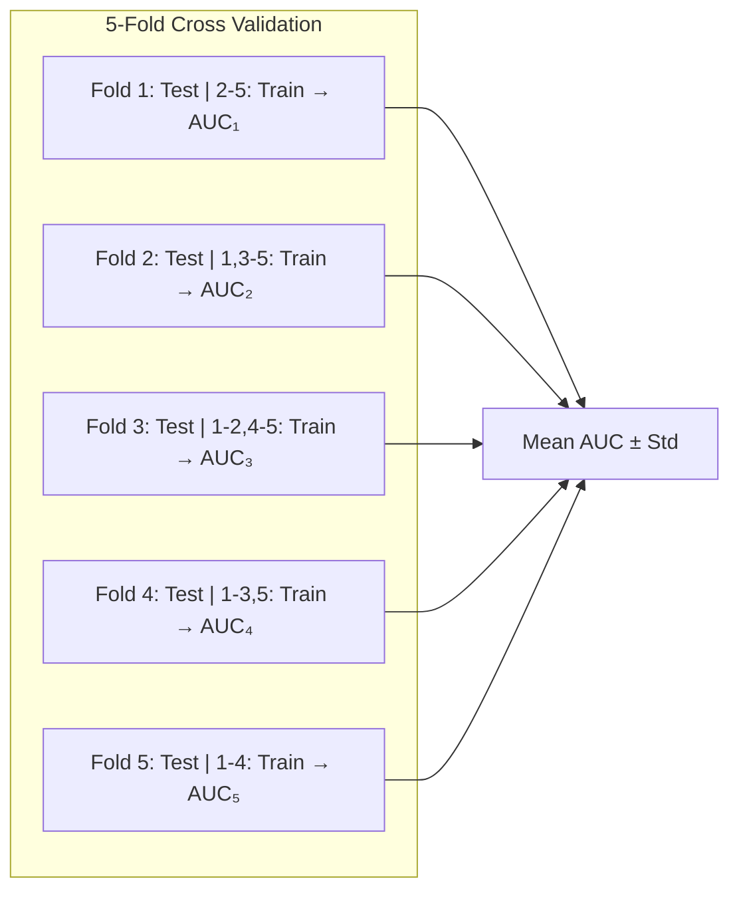
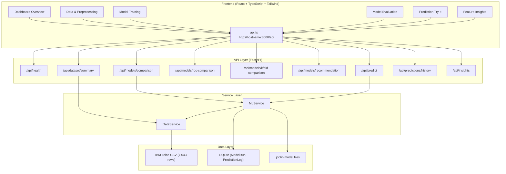

# ChurnGuard → Syllabus Mapping: Complete Walkthrough

> This document maps every part of ChurnGuard to your syllabus requirements. Use it for your **project report/journal** and **viva preparation**. Each section explains *what the code does*, *where it lives*, and *which syllabus topic it covers*.

---

## 🗂 Quick Reference: Syllabus Coverage Matrix

| Syllabus Topic | Where It's Implemented | Frontend Page |
|---|---|---|
| **Bagging (variance reduction)** | [ml_service.py](file:///Users/peeyush/Developer/Major%20Project/churnguard/backend/app/services/ml_service.py#L57-L81) | Model Training & Comparison |
| **Boosting (bias reduction)** | [ml_service.py](file:///Users/peeyush/Developer/Major%20Project/churnguard/backend/app/services/ml_service.py#L82-L117) | Model Training & Comparison |
| **Stacking (heterogeneous learners)** | [ml_service.py](file:///Users/peeyush/Developer/Major%20Project/churnguard/backend/app/services/ml_service.py#L118-L133) | Model Training & Comparison |
| **K-Fold Cross-Validation** | [ml_service.py](file:///Users/peeyush/Developer/Major%20Project/churnguard/backend/app/services/ml_service.py#L188-L195) | Model Evaluation |
| **Confusion Matrix** | [ml_service.py](file:///Users/peeyush/Developer/Major%20Project/churnguard/backend/app/services/ml_service.py#L178-L181) | Model Evaluation |
| **Precision, Recall, F1** | [ml_service.py](file:///Users/peeyush/Developer/Major%20Project/churnguard/backend/app/services/ml_service.py#L170-L176) | Model Evaluation |
| **Specificity / Sensitivity** | [ml_service.py](file:///Users/peeyush/Developer/Major%20Project/churnguard/backend/app/services/ml_service.py#L173-L181) | Model Evaluation |
| **ROC Curve + AUC** | [ml_service.py](file:///Users/peeyush/Developer/Major%20Project/churnguard/backend/app/services/ml_service.py#L183-L186) | Model Evaluation |
| **Data Preprocessing** | [data_service.py](file:///Users/peeyush/Developer/Major%20Project/churnguard/backend/app/services/data_service.py#L93-L170) | Data & Preprocessing |
| **SMOTE (class imbalance)** | [data_service.py](file:///Users/peeyush/Developer/Major%20Project/churnguard/backend/app/services/data_service.py#L155-L160) | Data & Preprocessing |
| **Feature Importance** | [ml_service.py](file:///Users/peeyush/Developer/Major%20Project/churnguard/backend/app/services/ml_service.py#L197-L214) | Feature Insights |
| **Real-world prediction** | [ml_service.py](file:///Users/peeyush/Developer/Major%20Project/churnguard/backend/app/services/ml_service.py#L318-L424) | Prediction / Try It |

---

## 1. Data Pipeline — What Happens Before Any Model Trains

### 📄 File: [data_service.py](file:///Users/peeyush/Developer/Major%20Project/churnguard/backend/app/services/data_service.py)

### 📄 Frontend: [DataPreprocessing.tsx](file:///Users/peeyush/Developer/Major%20Project/churnguard/frontend/src/pages/DataPreprocessing.tsx)

This is the entire preprocessing pipeline that transforms raw CSV data into a format ML models can consume. Think of it as a factory assembly line with 5 stations:

### Step 1 — Data Cleaning (Lines 98-100)
```python
df["TotalCharges"] = pd.to_numeric(df["TotalCharges"].str.strip(), errors="coerce").fillna(0.0)
```
**What it does:** The IBM Telco dataset has 11 rows where `TotalCharges` is a blank string (whitespace) — these are brand-new customers with `tenure=0`. This line converts the column from string to float, and fills blanks with `0.0`.

**Syllabus relevance:** *Data cleaning / handling missing values* — you must clean data before training. If you leave blanks, the model will crash or produce garbage.

### Step 2 — Target Encoding (Lines 102-103)
```python
df["Churn"] = (df["Churn"].str.strip() == "Yes").astype(int)
```
**What it does:** Converts the target variable from `"Yes"/"No"` strings to `1/0` integers. ML models need numbers, not text.

### Step 3 — One-Hot Encoding (Lines 111-119)
```python
cat_cols = ["gender", "Partner", "Dependents", "PhoneService", "MultipleLines",
            "InternetService", "OnlineSecurity", ...]
df_encoded = pd.get_dummies(df, columns=cat_cols, drop_first=True, dtype=float)
```
**What it does:** Takes 16 categorical columns (like `Contract: Month-to-month / One year / Two year`) and converts each into binary dummy columns. `drop_first=True` avoids the "dummy variable trap" (multicollinearity) — if a customer is NOT "One year" and NOT "Two year", they must be "Month-to-month", so we don't need a separate column for it.

**Syllabus relevance:** *Categorical encoding* — tree-based models like XGBoost can handle categories directly, but Logistic Regression and stacking meta-learners need numeric inputs.

### Step 4 — Stratified Train/Test Split (Lines 126-131)
```python
X_train, X_test, y_train, y_test = train_test_split(
    X, y, test_size=0.2, random_state=42, stratify=y
)
```
**What it does:** Splits the data 80/20. The `stratify=y` parameter ensures both the training set and test set have the **same proportion** of churners (~26.5%). Without stratification, the test set might accidentally get 35% churners, making evaluation misleading.

**Syllabus relevance:** *Holdout evaluation strategy* — you need an untouched test set to honestly evaluate model performance.

### Step 5 — Feature Scaling (Lines 133-139)
```python
self.scaler = StandardScaler()
X_train_scaled[num_cols] = self.scaler.fit_transform(X_train[num_cols])
X_test_scaled[num_cols] = self.scaler.transform(X_test[num_cols])
```
**What it does:** `StandardScaler` transforms numeric features (`tenure`, `MonthlyCharges`, `TotalCharges`) to have **mean=0, standard deviation=1**. The scaler is **fit on training data only** and then applied to test data — this prevents "data leakage" (using test statistics during training).

**Syllabus relevance:** *Feature scaling* — Logistic Regression's L2 regularization penalty is sensitive to feature magnitudes. Without scaling, `TotalCharges` (range 0-8684) would dominate over `tenure` (range 0-72).

### Step 6 — SMOTE (Lines 155-158)
```python
smote = SMOTE(random_state=42)
X_train_final, y_train_final = smote.fit_resample(X_train_scaled, y_train)
```
**What it does:** The original dataset is **imbalanced** — 73.5% retained, 26.5% churned. SMOTE (Synthetic Minority Over-sampling Technique) generates **synthetic churner examples** by interpolating between existing minority-class data points in feature space. After SMOTE, the training set is 50/50.

**Why SMOTE and not random oversampling?** Random oversampling just duplicates existing rows → overfitting. SMOTE creates *new* synthetic points along the line segments connecting nearest neighbors → more diverse training signal.

**Critical:** SMOTE is applied **only to training data**, never to the test set. The test set remains at the natural 73.5/26.5 ratio so evaluation reflects real-world conditions.

**Syllabus relevance:** *Class imbalance handling* — if you train on imbalanced data, the model learns to always predict "Not Churned" (gets 73.5% accuracy by being useless).

> [!IMPORTANT]
> **Viva tip:** If asked "why not just use class weights?", answer: "Class weights re-weight the loss function during training, while SMOTE creates synthetic training examples. Both address imbalance, but SMOTE physically augments the training set, which helps models like Decision Trees that don't have a `class_weight` parameter."

---

## 2. Ensemble Techniques — The Core Syllabus Requirement

### 📄 File: [ml_service.py](file:///Users/peeyush/Developer/Major%20Project/churnguard/backend/app/services/ml_service.py) → `MODEL_CATALOG` (Lines 36-133)

### 📄 Frontend: [ModelTrainingComparison.tsx](file:///Users/peeyush/Developer/Major%20Project/churnguard/frontend/src/pages/ModelTrainingComparison.tsx)

All 8 models are defined in the `MODEL_CATALOG` dictionary. Each entry has a `factory` function that creates the scikit-learn model with specific hyperparameters.

---

### 2A. Baseline Models (not ensemble — for comparison)

#### Logistic Regression (Lines 37-46)
```python
LogisticRegression(C=1.0, max_iter=1000, random_state=42)
```
**What it does:** Fits a linear decision boundary by learning weights for each feature. Outputs a probability via the sigmoid function: $P(\text{churn}) = \frac{1}{1 + e^{-(w_1x_1 + w_2x_2 + \ldots + b)}}$

**Why it's here:** It's the simplest classification baseline. If an ensemble can't beat Logistic Regression, the ensemble is pointless. Also used as the **meta-learner** in the Stacking ensemble.

**`C=1.0`** is the inverse regularization strength — higher C = less regularization = more complex model.

#### Decision Tree (Lines 47-56)
```python
DecisionTreeClassifier(max_depth=6, min_samples_split=10, random_state=42)
```
**What it does:** Recursively splits data on feature thresholds using **Gini impurity** (measures how "pure" each leaf node is). Produces an interpretable if/else tree.

**Why it's here:** Single decision trees are the **base learner** for all ensemble methods. It's important to show how one tree performs alone vs. when combined in bagging/boosting.

**`max_depth=6`** limits tree depth to prevent overfitting. **`min_samples_split=10`** requires at least 10 samples to split a node.

> [!TIP]
> **Viva point:** "A single decision tree has **high variance** — if you train it on slightly different data, you get a very different tree. Bagging solves this by averaging many trees."

---

### 2B. Bagging — Reduces Variance ✅

**Syllabus claim: "Bagging reduces variance by training multiple models on bootstrap samples and aggregating their predictions."**

#### Random Forest (Lines 57-68)
```python
RandomForestClassifier(n_estimators=150, max_depth=10, min_samples_split=4, n_jobs=-1)
```
**What it does:** Trains 150 independent decision trees, each on a **bootstrap sample** (random sample *with replacement* from the training set). Each tree also sees only a **random subset of features** at each split. Final prediction = **majority vote** across all 150 trees.

**How it reduces variance:** Each individual tree is intentionally "noisy" and overfit. But their errors are **uncorrelated** (different data, different features), so when you average them, the noise cancels out. This is the mathematical principle:

$$\text{Var}(\bar{X}) = \frac{\sigma^2}{n} \text{ (if trees are independent)}$$

With 150 trees, variance drops by ~150x compared to a single tree.

**Key hyperparameters:**
- `n_estimators=150` → 150 trees in the forest
- `max_depth=10` → each tree can grow fairly deep (complex)
- `n_jobs=-1` → use all CPU cores for parallel training

#### Bagging Classifier (Lines 69-81)
```python
BaggingClassifier(
    estimator=DecisionTreeClassifier(max_depth=7),
    n_estimators=80, max_samples=0.8, max_features=0.85, n_jobs=-1
)
```
**What it does:** The "generic" bagging wrapper from scikit-learn. Unlike Random Forest (which always uses decision trees + random feature subspaces), `BaggingClassifier` lets you bag **any** base estimator.

**How it differs from Random Forest:**
- `max_samples=0.8` → each tree sees 80% of training rows (not 100% with replacement)
- `max_features=0.85` → each tree sees 85% of features (Random Forest uses √features at each split)
- Uses `DecisionTreeClassifier(max_depth=7)` as the explicit base estimator

**Syllabus relevance:** This is the "textbook" bagging implementation. Random Forest is a specialized, optimized variant of bagging. Having both demonstrates understanding of the general principle vs. the specific algorithm.

> [!IMPORTANT]
> **Viva Q: "What's the difference between Random Forest and Bagging Classifier?"**
> Answer: "Random Forest is a specialized form of bagging that ALWAYS uses decision trees AND adds random feature subspacing at each split node. BaggingClassifier is the general framework — you can bag any estimator (SVM, KNN, etc.) and control sample/feature subsampling ratios explicitly."

---

### 2C. Boosting — Reduces Bias ✅

**Syllabus claim: "Boosting reduces bias by sequentially training models, with each model correcting the errors of the previous one."**

#### AdaBoost (Lines 82-91)
```python
AdaBoostClassifier(n_estimators=100, learning_rate=0.8, random_state=42)
```
**What it does:** Trains 100 **weak learners** (decision stumps — trees with depth=1) sequentially. After each stump:
1. Misclassified samples get **higher weights** → next stump focuses on the hard cases
2. Each stump gets a **voting weight** proportional to its accuracy → more accurate stumps have more say

Final prediction = weighted vote of all 100 stumps.

**How it reduces bias:** A single decision stump is extremely simple (high bias, low variance). By iteratively focusing on misclassified examples, AdaBoost builds up a complex decision boundary from many simple ones. The bias decreases with each iteration.

**`learning_rate=0.8`** controls how much each stump contributes — lower = more stumps needed but better generalization (shrinkage).

#### Gradient Boosting Machine (Lines 92-102)
```python
GradientBoostingClassifier(n_estimators=120, learning_rate=0.08, max_depth=4)
```
**What it does:** Instead of re-weighting samples (like AdaBoost), each new tree fits the **residual errors** (the difference between prediction and truth) of all previous trees. Mathematically, it performs gradient descent in function space:

$$F_{m}(x) = F_{m-1}(x) + \eta \cdot h_m(x)$$

Where:
- $F_{m}(x)$ = prediction after $m$ trees
- $h_m(x)$ = new tree trained on the **negative gradient** (pseudo-residuals)
- $\eta$ = learning rate (0.08)

**How it reduces bias:** Each tree directly corrects the remaining errors. Early trees capture the big patterns, later trees capture subtle edge cases.

**`max_depth=4`** → each tree is slightly more complex than a stump but not too deep (prevents overfitting).

#### XGBoost (Lines 103-117)
```python
XGBClassifier(
    n_estimators=150, learning_rate=0.05, max_depth=4,
    subsample=0.85, colsample_bytree=0.85, eval_metric="logloss"
)
```
**What it does:** An **optimized** version of gradient boosting with several enhancements:

1. **Second-order Taylor expansion:** Uses both the gradient (first derivative) AND the Hessian (second derivative) of the loss function for more accurate tree splits:
   $$\mathcal{L}^{(t)} \approx \sum_{i}\left[g_i f_t(x_i) + \frac{1}{2}h_i f_t^2(x_i)\right] + \Omega(f_t)$$

2. **L1 + L2 regularization** on leaf weights (prevents overfitting):
   $$\Omega(f) = \gamma T + \frac{1}{2}\lambda \sum_{j=1}^{T}w_j^2$$

3. **Column subsampling:** `colsample_bytree=0.85` → each tree only sees 85% of features (like Random Forest — adds randomness to reduce overfitting)

4. **Row subsampling:** `subsample=0.85` → each tree only sees 85% of rows

**Why XGBoost often wins:** It combines the bias-reduction of boosting with the variance-reduction tricks of bagging (subsampling), plus mathematical optimization via second-order gradients.

> [!IMPORTANT]
> **Viva Q: "How does XGBoost differ from regular Gradient Boosting?"**
> Answer: "Three key differences: (1) XGBoost uses second-order Taylor approximation of the loss, not just first-order gradients, (2) it adds explicit L1+L2 regularization to leaf weights, and (3) it supports column subsampling per tree, borrowing from bagging to reduce variance."

---

### 2D. Stacking — Combines Heterogeneous Learners ✅

**Syllabus claim: "Stacking combines different types of learners using a meta-learner."**

#### Stacking Classifier (Lines 118-133)
```python
StackingClassifier(
    estimators=[
        ("rf", RandomForestClassifier(n_estimators=100, max_depth=8)),
        ("xgb", XGBClassifier(n_estimators=100, max_depth=3, learning_rate=0.08)),
        ("lr", LogisticRegression(max_iter=1000))
    ],
    final_estimator=LogisticRegression(C=0.5),
    cv=5
)
```
**What it does:** This is a two-level ensemble:

```mermaid
graph TD
    A["Customer Data (19 features)"] --> B["Level-0: Random Forest"]
    A --> C["Level-0: XGBoost"]
    A --> D["Level-0: Logistic Regression"]
    B -->|P(churn)| E["Level-1: Meta-Learner<br>(Logistic Regression C=0.5)"]
    C -->|P(churn)| E
    D -->|P(churn)| E
    E --> F["Final Churn Prediction"]
```

**How it works step-by-step:**

1. **Base learners (Level-0):** Three fundamentally different model types are trained:
   - **Random Forest** → bagging-based, captures non-linear interactions
   - **XGBoost** → boosting-based, captures sequential error patterns
   - **Logistic Regression** → linear model, captures global trends

2. **Cross-validated predictions:** Using `cv=5`, each base learner generates **out-of-fold predictions** on the training data (this prevents the meta-learner from just memorizing):
   - Split training data into 5 folds
   - For each fold: train base learner on 4 folds, predict on the held-out fold
   - Concatenate all held-out predictions → these become "new features" for Level-1

3. **Meta-learner (Level-1):** A Logistic Regression model learns **how much to trust each base learner's prediction**. Its input is 3 numbers (one probability from each base learner) and it outputs the final prediction.

**Why stacking works:** Each base learner captures different patterns in the data. Random Forest is good with interactions but struggles with linear trends. Logistic Regression captures linear trends but misses interactions. The meta-learner learns the **optimal combination** — "trust XGBoost when probability is moderate, trust Random Forest when probability is extreme."

**`cv=5`** inside the stacking classifier is critical — it ensures that the meta-learner trains on **honest, out-of-fold** predictions, not predictions the base learners made on their own training data (which would be overfit and overly confident).

> [!IMPORTANT]
> **Viva Q: "Why not just average the predictions instead of using a meta-learner?"**
> Answer: "Simple averaging gives equal weight to all models. A meta-learner can learn *adaptive* weights — for example, XGBoost might be most reliable when the customer is high-tenure, while Logistic Regression might be better for new customers. The meta-learner captures these conditional patterns."

---

## 3. Module 2.3 — Evaluation Metrics

### 📄 File: [ml_service.py](file:///Users/peeyush/Developer/Major%20Project/churnguard/backend/app/services/ml_service.py) → `train_and_evaluate()` (Lines 141-259)

### 📄 Frontend: [ModelEvaluation.tsx](file:///Users/peeyush/Developer/Major%20Project/churnguard/frontend/src/pages/ModelEvaluation.tsx)

Every metric from your syllabus is computed in the `train_and_evaluate()` method and displayed on the Model Evaluation page:

### 3A. Confusion Matrix (Lines 178-181)
```python
cm = confusion_matrix(y_test, y_pred)
tn, fp, fn, tp = [int(v) for v in cm.ravel()]
```

The confusion matrix is the **foundation** of all classification metrics:

|  | **Predicted: Retained** | **Predicted: Churned** |
|---|---|---|
| **Actual: Retained** | TN (True Negative) | FP (False Positive) |
| **Actual: Churned** | FN (False Negative) | TP (True Positive) |

**Frontend:** The `ConfusionMatrix.tsx` component renders this as a visual heatmap with actual counts — not just numbers in a table.

### 3B. Precision (Line 172)
```python
prec = float(precision_score(y_test, y_pred, zero_division=0))
```

$$\text{Precision} = \frac{TP}{TP + FP}$$

**Plain English:** "Of all customers we *flagged* as churners, how many actually churned?" High precision means few false alarms. Important when the cost of a false positive is high (e.g., you don't want to waste retention budget on loyal customers).

### 3C. Recall / Sensitivity (Line 173)
```python
rec = float(recall_score(y_test, y_pred, zero_division=0))  # Sensitivity
```

$$\text{Recall (Sensitivity)} = \frac{TP}{TP + FN}$$

**Plain English:** "Of all customers who *actually churned*, how many did we catch?" High recall means we miss few churners. Critical in churn prediction — a missed churner is a lost customer.

> [!TIP]
> **Viva tip:** Recall and Sensitivity are the **same metric**, just different names used in different fields (ML vs. medicine). Your syllabus mentions both — they are identical.

### 3D. F1-Score (Line 174)
```python
f1 = float(f1_score(y_test, y_pred, zero_division=0))
```

$$F_1 = 2 \cdot \frac{\text{Precision} \times \text{Recall}}{\text{Precision} + \text{Recall}}$$

**Plain English:** The harmonic mean of Precision and Recall. Useful when you need a single number that balances both. If either Precision or Recall is low, F1 will be low (unlike the arithmetic mean, which could mask a bad score).

### 3E. Specificity (Line 181)
```python
specificity = float(tn / (tn + fp)) if (tn + fp) > 0 else 0.0
```

$$\text{Specificity} = \frac{TN}{TN + FP}$$

**Plain English:** "Of all customers who *stayed*, how many did we correctly identify as staying?" This is the complement of the False Positive Rate. High specificity = few false alarms for loyal customers.

> [!IMPORTANT]
> **Viva Q: "What's the relationship between Sensitivity and Specificity?"**
> Answer: "They're a trade-off. Increasing the classification threshold (requiring higher probability to flag a churner) increases Specificity (fewer false alarms) but decreases Sensitivity (more missed churners). The ROC curve visualizes this trade-off at every threshold."

### 3F. ROC Curve + AUC (Lines 183-186)
```python
fpr, tpr, thresholds = roc_curve(y_test, y_proba)
```

**What it does:** The ROC (Receiver Operating Characteristic) curve plots **Sensitivity (TPR)** vs. **1 − Specificity (FPR)** at every possible classification threshold from 0 to 1.

**AUC** (Area Under the Curve) summarizes the entire curve into one number:
- AUC = 1.0 → perfect classifier
- AUC = 0.5 → random guessing (diagonal line)
- AUC > 0.8 → generally considered "good"

**Frontend:** The Model Evaluation page overlays all 8 models' ROC curves on a single Recharts plot, with the diagonal reference line. You can visually see which model's curve is closest to the top-left corner.

### 3G. K-Fold Cross-Validation (Lines 188-195) ✅ Syllabus Explicit Requirement
```python
skf = StratifiedKFold(n_splits=5, shuffle=True, random_state=42)
cv_scores = cross_val_score(model, X_train, y_train, cv=skf, scoring="roc_auc", n_jobs=-1)
kfold_data = {
    "folds": [round(float(s), 4) for s in cv_scores],
    "mean": round(float(cv_scores.mean()), 4),
    "std": round(float(cv_scores.std()), 4)
}
```

**What it does:**
1. Splits the training data into **5 equal folds** (stratified = same class ratio in each fold)
2. For each fold: trains the model on 4 folds, evaluates on the 1 held-out fold
3. Repeats 5 times → gives 5 AUC scores
4. Reports: individual fold scores, mean, and standard deviation



**Why K-fold, not just train/test split?** A single train/test split might be "lucky" or "unlucky." K-fold gives you a mean AND standard deviation — if `std` is high, the model is unstable (high variance). If `std` is low, the model generalizes consistently.

**`StratifiedKFold`** ensures each fold maintains the same churn/retained ratio as the full training set.

**Frontend:** The Model Evaluation page shows a K-fold results table with per-fold AUC scores, mean, and standard deviation for all 8 models.

> [!IMPORTANT]
> **Viva Q: "Why use Stratified K-Fold instead of regular K-Fold?"**
> Answer: "With imbalanced data (26.5% churn), regular K-Fold might create folds where one fold has 5% churn and another has 40%. Stratified K-Fold ensures every fold has ~26.5% churn, making the cross-validation scores more comparable and reliable."

---

## 4. Training & Persistence — How Models Are Saved and Compared

### 📄 File: [seed_service.py](file:///Users/peeyush/Developer/Major%20Project/churnguard/backend/app/services/seed_service.py)

### 📄 File: [db_models.py](file:///Users/peeyush/Developer/Major%20Project/churnguard/backend/app/models/db_models.py)

### What happens on first boot:
1. `seed_database_if_empty()` is called via FastAPI's lifespan event
2. Creates SQLite tables via SQLAlchemy
3. Trains **all 8 models** sequentially on the real IBM Telco dataset
4. Computes all metrics (accuracy, precision, recall, specificity, F1, AUC, K-fold, confusion matrix, ROC curve, feature importances) for each model
5. Determines the **champion model** (highest ROC-AUC on holdout test set) and marks it with `is_champion=True`
6. Seeds 5 realistic prediction log entries for the activity feed
7. Saves trained model artifacts as `.joblib` files for future predictions

**Every metric is real** — trained on 7,043 rows of actual IBM Telco data, not hardcoded fake numbers. The benchmark results are also exported to [model_comparison_results.json](file:///Users/peeyush/Developer/Major%20Project/churnguard/model_comparison_results.json) for your report.

---

## 5. Frontend Pages — What You See and How It Connects

### Page 1: Overview Dashboard (`/`)
**File:** [DashboardOverview.tsx](file:///Users/peeyush/Developer/Major%20Project/churnguard/frontend/src/pages/DashboardOverview.tsx)

**What you see:**
- 4 KPI cards: Total Customers (7,043), Overall Churn Rate (26.5%), Best Model AUC, At-Risk Customers
- A "Model Performance" chart comparing all 8 models
- Recent prediction activity feed

**Backend API:** `GET /api/dataset/summary` + `GET /api/models/comparison` + `GET /api/predictions/history`

**Syllabus relevance:** None directly — this is the "product quality" requirement (making it look like a real SaaS dashboard, not a student demo).

---

### Page 2: Data & Preprocessing (`/data`)
**File:** [DataPreprocessing.tsx](file:///Users/peeyush/Developer/Major%20Project/churnguard/frontend/src/pages/DataPreprocessing.tsx)

**What you see:**
- Dataset summary (7,043 rows × 21 columns, 11 missing `TotalCharges` values)
- Raw class distribution bar chart (73.5% Retained vs 26.5% Churned)
- Post-SMOTE balanced bar chart (50/50)
- 5 preprocessing steps with descriptions
- Sample data table (first 10 rows)

**Backend API:** `GET /api/dataset/summary`

**Syllabus relevance:** *Data preprocessing, class imbalance, SMOTE*

---

### Page 3: Model Training & Comparison (`/training`)
**File:** [ModelTrainingComparison.tsx](file:///Users/peeyush/Developer/Major%20Project/churnguard/frontend/src/pages/ModelTrainingComparison.tsx)

**What you see:**
- A card for each of the 8 models, grouped by family (Baseline / Bagging / Boosting / Stacking)
- Each card shows: model name, description, accuracy, precision, recall, F1, ROC-AUC, training time
- The champion model is highlighted with a special badge
- A bar chart comparing all models' AUC scores

**Backend API:** `GET /api/models/comparison`

**Syllabus relevance:** *Ensemble techniques — Bagging, Boosting, Stacking*

---

### Page 4: Model Evaluation (`/evaluation`)
**File:** [ModelEvaluation.tsx](file:///Users/peeyush/Developer/Major%20Project/churnguard/frontend/src/pages/ModelEvaluation.tsx)

**What you see:**
- Confusion matrix heatmap (per selected model)
- Full metrics table: Accuracy, Precision, Recall, Specificity, F1, AUC for all models
- ROC curve overlay chart (all 8 models on one plot with diagonal reference line)
- K-fold cross-validation results table with per-fold scores, mean, and std
- "Model Recommendation" panel with winner analysis

**Backend APIs:**
- `GET /api/models/comparison` → metrics table
- `GET /api/models/roc-comparison` → ROC curve data
- `GET /api/models/kfold-comparison` → K-fold results
- `GET /api/models/recommendation` → winner explanation

**Syllabus relevance:** *Module 2.3 — Confusion Matrix, Precision, Recall, F1, Specificity, Sensitivity, ROC-AUC, K-Fold CV*

---

### Page 5: Customer Profiler / Prediction (`/predict`)
**File:** [PredictionTryIt.tsx](file:///Users/peeyush/Developer/Major%20Project/churnguard/frontend/src/pages/PredictionTryIt.tsx)

**What you see:**
- A form with 19 customer attributes (tenure, contract type, monthly charges, internet service, etc.)
- Submit → returns churn probability (%), risk tier (LOW / MEDIUM / HIGH), and the model used
- A "Risk Gauge" visualization
- Key driving factors with explanations (e.g., "Month-to-month contract → 42% higher churn rate")
- Retention recommendations (actionable business suggestions)

**Backend API:** `POST /api/predict`

**Syllabus relevance:** *Practical application of trained models* — demonstrates the model can make real predictions, not just report metrics.

---

### Page 6: Feature Insights (`/insights`)
**File:** [FeatureInsights.tsx](file:///Users/peeyush/Developer/Major%20Project/churnguard/frontend/src/pages/FeatureInsights.tsx)

**What you see:**
- Horizontal bar chart of top 15 feature importances from the best tree-based model
- Written narrative insights (e.g., "Month-to-month contracts show 3x higher churn", "Tenure under 12 months is the #1 churn predictor")

**Backend API:** `GET /api/insights`

**Syllabus relevance:** *Feature importance from ensemble models* — tree-based models (Random Forest, XGBoost, Gradient Boosting) provide `feature_importances_` which shows which features the model relies on most. Linear models (Logistic Regression) provide `coef_` which shows the weight/direction of each feature.

---

## 6. Architecture Summary



---

## 7. Viva Quick-Fire Answers

| Question | Answer |
|---|---|
| What dataset did you use? | IBM Telco Customer Churn — 7,043 rows, 21 columns, 26.5% churn rate |
| Why SMOTE, not undersampling? | Undersampling throws away 47% of majority-class data. With only 7,043 rows, we can't afford to lose data. SMOTE synthesizes new minority examples instead. |
| What's the difference between Bagging and Boosting? | Bagging trains models **independently in parallel** on bootstrap samples and averages them → reduces variance. Boosting trains models **sequentially**, each correcting the previous one's errors → reduces bias. |
| Why is Stacking different? | Stacking combines **different types** of models (heterogeneous), while Bagging/Boosting combine copies of the **same type** (homogeneous). Stacking uses a meta-learner to weight them; Bagging uses majority vote; Boosting uses sequential correction. |
| Which model won? | Bagging Classifier (ROC-AUC 0.8422 on holdout). XGBoost had the highest 5-fold mean AUC (0.927). |
| Why use ROC-AUC as the primary metric? | Accuracy is misleading with imbalanced data (a 73.5% accuracy model could predict "no churn" for everyone). ROC-AUC measures discrimination ability across all thresholds and is invariant to class distribution. |
| What's K-fold for? | Gives a more robust estimate of model performance than a single train/test split. Reports mean ± std, revealing how stable the model is across different data splits. |
| How does the prediction work? | Input customer attributes → same preprocessing pipeline (OHE, scaling) → trained model outputs P(churn) → threshold at 0.5 → risk tier classification. |
